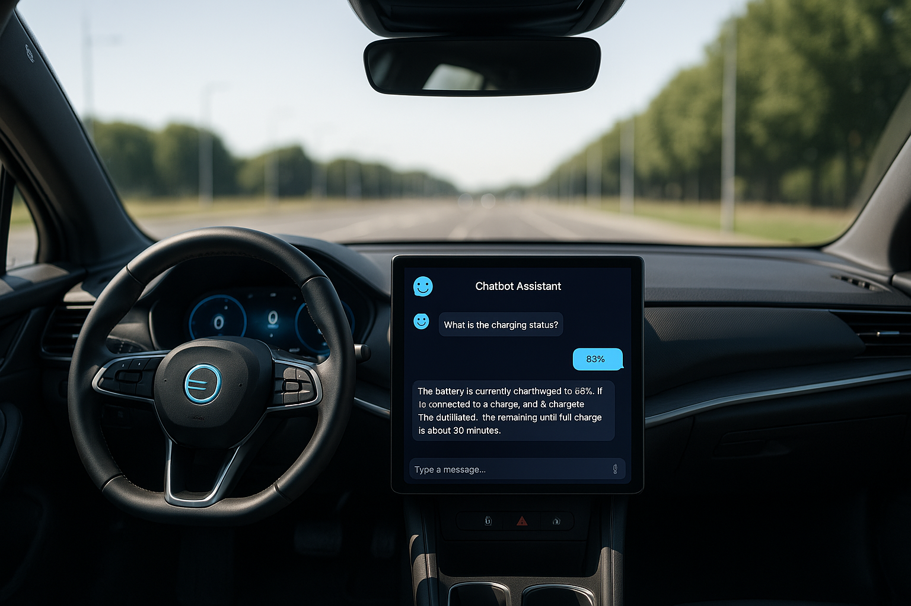

# 🚗 MG ZS Smart Warning Assistant — RAG-Powered Car Manual Chatbot

This project is a **proof-of-concept** for a voice-assisted, **context-aware chatbot** designed to be integrated into vehicles. By leveraging **LLMs**, **LangGraph**, and **Retrieval Augmented Generation (RAG)**, this assistant helps drivers understand car warning messages directly from the official MG ZS car manual.

---

## 📘 Project Overview

In this prototype, we use:

- A few selected pages from the MG ZS car manual (`mg-zs-warning-messages.html`)
- LangGraph to handle multi-turn conversations and memory
- Retrieval Augmented Generation (RAG) to ground responses in the manual
- A LangChain client to streamline interaction
- A future-ready design to integrate text-to-speech functionality

---

## 🛠️ Technologies Used

- **LangGraph** – Orchestrates the conversational flow using graph logic.
- **LangChain** – For retrieval-based question answering (RAG).
- **LLMs (OpenAI, etc.)** – To generate human-like and accurate responses.
- **Text-to-Speech** (optional/future) – To read responses aloud.

---

## ⚙️ How It Works

1. **Manual Parsing**:
   - The `mg-zs-warning-messages.html` file is parsed to extract structured data on warning messages, their meanings, and recommended actions.

2. **Indexing**:
   - The extracted content is embedded and indexed using LangChain’s retriever.

3. **RAG Workflow**:
   - A user query (e.g., "What does the engine warning light mean?") is passed through a LangGraph flow.
   - The retriever fetches relevant manual content.
   - The LLM generates a concise, context-aware response.

4. **Client Interaction**:
   - The LangChain client handles chat sessions and facilitates future TTS integration.

---

## 🚀 Getting Started

### Prerequisites

- Python 3.13+
- OpenAI API Key (or similar LLM provider)
- Install required packages:
  ```bash
  pip install -r requirements.txt
